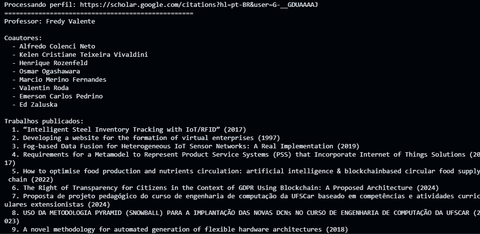

# 🚀 universafinity_scraper 🖥

Esse repositório tem como objetivo conter o código do scraper a ser utilizado no projeto da criação de um sistema que permita conectar autores, co-autores e editais de pesquisa e fomento científico.

O código atualmente faz uso do [Scholarly](https://scholarly.readthedocs.io/en/latest/quickstart.html#) para conseguir os dados do Google Scholar de maneira ética e que não vá contra as políticas da plataforma.

Os resultados atuais são:
- A partir de uma lista de ID's de docentes (do perfil do Scholar) é possível extrair Nome, Coautores, Trabalhos e ainda, caso necessários, todos os autores destes trabalhos adquiridos.
- Exibição amigável dos resultados
- Tempo de execução demorado 😪

